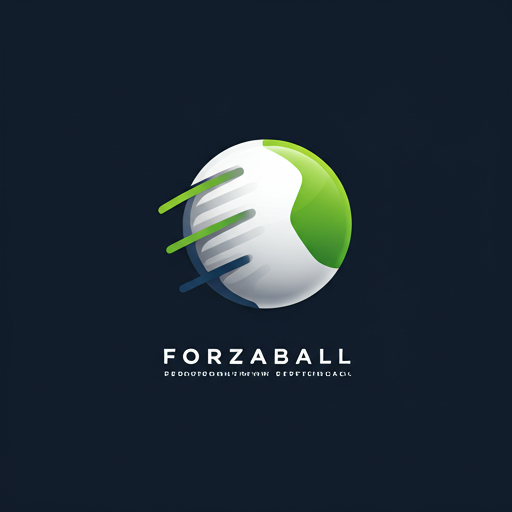

<p align="center">
  
</p>

<h1 align="center">ForzaBall</h1>

<p align="center">
  <strong>Your ultimate fan app</strong> — live scores, fixtures, league headlines, team discovery, and a social feed built around the clubs you love.
</p>

<p align="center">
  <a href="https://play.google.com/store/apps/details?id=com.forzaball.pro"></a>
  <a href="https://github.com/EngMahmoudMagdy/forza-ball-public"></a>
</p>

<p align="center">
  <a href="https://www.linkedin.com/in/mahmoudmagdy7">LinkedIn</a> ·
  <a href="https://github.com/EngMahmoudMagdy">GitHub</a> ·
  <a href="https://engmahmoudmagdy.github.io/">Portfolio</a>
</p>

<p align="center">
  
  
  
  
  
</p>

---

## Table of contents

- [Download](#download)
- [Release info](#release-info)
- [Author & links](#author--links)
- [Overview](#overview)
- [Features](#features)
- [Architecture](#architecture)
- [APIs & data sources](#apis--data-sources)
- [Tech stack](#tech-stack)
- [AI-assisted development](#ai-assisted-development)
- [Project structure](#project-structure)
- [Getting started](#getting-started)
- [Testing](#testing)
- [Privacy & compliance](#privacy--compliance)
- [License](#license)
- [Contact](#contact)

---

## Download

| Platform | Link |
|----------|------|
| **Google Play** | [**ForzaBall App**](https://play.google.com/store/apps/details?id=com.forzaball.pro) |

Install the production build: [play.google.com/store/apps/details?id=com.forzaball.pro](https://play.google.com/store/apps/details?id=com.forzaball.pro)

---

## Release info

| Field | Value |
|-------|--------|
| **Application ID** | `com.forzaball.pro` |
| **Version name** | `1.0.1` |
| **Version code** | `2` |
| **minSdk** | 27 |
| **targetSdk / compileSdk** | 36 |
| **JVM** | 17 |

Release constants are defined in [`app/build.gradle.kts`](app/build.gradle.kts).

---

## Author & links

Built and maintained by **Mahmoud Magdy**.

| Resource | URL |
|----------|-----|
| **LinkedIn** | [linkedin.com/in/mahmoudmagdy7](https://www.linkedin.com/in/mahmoudmagdy7) |
| **GitHub profile** | [github.com/EngMahmoudMagdy](https://github.com/EngMahmoudMagdy) |
| **Portfolio** | [engmahmoudmagdy.github.io](https://engmahmoudmagdy.github.io/) |
| **Public source** | [github.com/EngMahmoudMagdy/forza-ball-public](https://github.com/EngMahmoudMagdy/forza-ball-public) |
| **Google Play** | [ForzaBall on Play Store](https://play.google.com/store/apps/details?id=com.forzaball.pro) |

---

## Overview

**ForzaBall** is a native Android application for football fans who want **one place** for match day: personalized home content, live and upcoming fixtures, ESPN-powered news, team search with synced history, rich team profiles, authentication, favorites, and a **community social feed** with push notifications for posts, comments, and reactions.

The codebase follows **Clean Architecture**, **Jetpack Compose**, and a **modular** structure that is actively prepared for **Kotlin Multiplatform (KMP)** sharing between Android and future iOS targets.

---

## Features

### Match day & content

- **Personalized home** driven by favorite leagues and clubs (domestic + UEFA Champions League schedule merging where applicable).
- **Live scores & fixtures** from ESPN scoreboards and team schedules, with **Paging 3** for long fixture lists.
- **League & team news** with in-app article reading (WebView) and dedicated news list flows.
- **Standings snapshots** for favorite teams via ESPN tables API (with KMP adapter path for shared logic).

### Discovery

- **Team & league search** with **recent search history** synced via Firestore when signed in.
- **Team profile screens** — crest, next match, news, and context for the selected club.

### Account & personalization

- **Onboarding** and multi-step **personalization** (leagues, teams, preferences).
- **Firebase Authentication** — email/password and **Google Sign-In**.
- **Profile**, edit favorites, theme preferences, and account deletion flow (hosted policy page + Cloud Functions).

### Social

- **Community feed** — create posts, comments, likes/dislikes.
- **Cloud Firestore** real-time updates and **Firebase Cloud Messaging** for feed activity (Cloud Functions fan-out to FCM topics and per-user tokens).
- In-app notification center and high-priority Android notification channel for social events.

### Platform quality

- Branded **splash** and app icon, **edge-to-edge** Compose UI, light/dark theming.
- **Firebase Crashlytics**, **Analytics**, and **Performance Monitoring**.
- **Play Integrity** and **AndroidX Security Crypto** for hardened client practices.
- **CameraX** and **Media3 (ExoPlayer)** for media capture and playback.

---

## Architecture

```
┌─────────────────────────────────────────────────────────────┐
│  app (Compose UI, Navigation, ViewModels, Koin modules)      │
├─────────────────────────────────────────────────────────────┤
│  domain (models, repository contracts, business rules)       │
├─────────────────────────────────────────────────────────────┤
│  data (Retrofit/ESPN, Firestore, repository implementations) │
├─────────────────────────────────────────────────────────────┤
│  shared/* (KMP-ready: core-domain, core-auth, core-data,     │
│            shared-ui-compose, platform)                      │
└─────────────────────────────────────────────────────────────┘
```

| Layer | Responsibility |
|-------|----------------|
| **Presentation** | Compose screens, `ViewModel` / MVI-style state (`MviViewModel`), Navigation Compose, **Koin** |
| **Domain** | `AuthRepository`, `MatchRepository`, `NewsRepository`, `FeedRepository`, `PreferencesRepository`, pure Kotlin models |
| **Data** | ESPN HTTP (Retrofit + kotlinx.serialization), Firestore, DataStore preferences, paging sources |
| **Backend** | Firebase (Auth, Firestore, FCM, Cloud Functions in `functions/`) |

**Patterns:** Repository pattern, unidirectional UI state, **Kotlin Coroutines** + `Flow`, **Paging 3** for news/fixtures lists, dependency injection with **Koin**.

**KMP rollout:** Shared modules compile on JVM/iOS simulator targets; Android keeps stable adapters until each feature is migrated.

---

## APIs & data sources

| Source | Usage |
|--------|--------|
| **[ESPN Site API](https://site.api.espn.com/apis/site/v2/sports/soccer/)** | Scoreboards, team schedules, news, team catalog |
| **[ESPN Soccer Tables API](https://site.api.espn.com/apis/v2/sports/soccer/)** | League standings |
| **Firebase Auth** | Email, Google Sign-In |
| **Cloud Firestore** | User profiles, feed posts/comments, notifications, search history sync, FCM token storage |
| **Firebase Cloud Messaging** | Push notifications (triggered from Cloud Functions on feed events) |
| **Firebase Cloud Functions** | Feed notification fan-out, account deletion, server-side Firestore batching |

> ESPN public endpoints power **soccer content** (fixtures, news, standings). Social data lives in **Firebase**.

---

## Tech stack

### Core

| Technology | Version |
|------------|---------|
| Kotlin | 2.3.10 |
| Android Gradle Plugin | 9.0.0 |
| compileSdk / targetSdk | 36 |
| minSdk | 27 |
| JVM | 17 |

### UI

| Library | Version |
|---------|---------|
| Compose BOM | 2026.02.01 |
| Navigation Compose | 2.9.7 |
| Coil | 2.7.0 |
| Accompanist | 0.36.0 |
| CameraX | 1.5.3 |
| Media3 ExoPlayer | 1.9.2 |

Material 3, adaptive navigation suite, edge-to-edge Compose.

### Architecture & async

- Clean Architecture modules (`:app`, `:domain`, `:data`, `:shared:*`)
- Coroutines 1.10.2 · StateFlow · Paging 3.4.1 Compose
- Koin 4.1.1

### Networking

| Library | Version |
|---------|---------|
| Retrofit | 3.0.0 |
| OkHttp (logging) | 5.3.2 |
| kotlinx.serialization | 1.10.0 |
| Ktor (KMP) | 3.3.1 |
| Chucker (debug) | 4.2.0 |

Timber for logging.

### Persistence & background

| Library | Version |
|---------|---------|
| DataStore Preferences | 1.2.0 |
| Room | 2.8.4 |
| WorkManager | 2.11.1 |
| SQLCipher | 4.5.7 |

### Firebase & Google

| Service | Version / notes |
|---------|-----------------|
| Firebase BOM | 34.11.0 |
| Auth, Firestore, FCM, Crashlytics, Analytics, Performance | via BOM |
| Google Play Services Auth | 21.5.1 |
| Play Integrity API | 1.6.0 |
| AndroidX Security Crypto | 1.1.0 |

---

## AI-assisted development

ForzaBall was built with a modern **AI-augmented workflow** alongside traditional engineering practices. AI accelerates delivery; architecture, security, and UX decisions remain human-led.

| Tool | Role |
|------|------|
| **[Cursor](https://cursor.com/) agents** | Feature scaffolding, refactors, test generation, DI/navigation wiring, and rapid iteration across modules |
| **LLM pair programming** | ESPN DTO → domain mapping, Firestore rules alignment, Paging/Compose state fixes, Cloud Functions logic |
| **[Google Stitch](https://stitch.withgoogle.com/)** | UI exploration, screen layout direction, and design-to-implementation handoff for Compose screens (`design_codes/` HTML references) |
| **Human review** | Clean Architecture boundaries, security (Firestore rules, Play Integrity), UX polish, and Play Store release |

Design intent from **Google Stitch** was translated into **Material 3 Compose** components and the app theme system—maintainable, accessible UI rather than static asset dumps.

---

## Project structure

```
ForzaBall/
├── app/                    # Compose UI, MainActivity, feature packages
├── domain/                 # Repository interfaces & domain models
├── data/                   # ESPN, Firestore, repository implementations
├── shared/
│   ├── core-domain/
│   ├── core-auth/
│   ├── core-data/
│   ├── platform/
│   └── shared-ui-compose/  # KMP UI primitives (rollout in progress)
├── functions/              # Firebase Cloud Functions (Node.js)
├── hosting/                # Static pages (e.g. account deletion)
└── design_codes/           # Stitch / design reference HTML
```

---

## Getting started

### Prerequisites

- Android Studio Ladybug or newer
- JDK 17
- Android SDK 36

### Clone & run

```bash
git clone https://github.com/EngMahmoudMagdy/forza-ball-public.git
cd forza-ball-public
```

1. Add `google-services.json` from your Firebase project to `app/`.
2. For release builds, create `store.properties` at the project root (pattern in repo; file is gitignored).
3. Sync Gradle and run:

```bash
./gradlew :app:installDebug
```

### Useful tasks

```bash
./gradlew :app:compileDebugKotlin
./gradlew :shared:core-domain:compileKotlinJvm
./gradlew testDebugUnitTest
```

---

## Testing

- Unit tests for ESPN DTO mapping and domain preference logic (`data/src/test`, `domain/src/test`)
- Compose UI test dependencies configured for instrumented/UI tests

```bash
./gradlew testDebugUnitTest
```

---

## Privacy & compliance

- [Google Play listing](https://play.google.com/store/apps/details?id=com.forzaball.pro) — data safety declarations (personal info, photos/videos, encryption in transit, deletion requests)
- Account deletion hosted page under `hosting/account-delete/`

---

## License

All rights reserved © Mahmoud Magdy.

Source is published for portfolio and technical review; commercial use of the codebase requires permission.

---

## Contact

| Channel | Link |
|---------|------|
| **LinkedIn** | [mahmoudmagdy7](https://www.linkedin.com/in/mahmoudmagdy7) |
| **GitHub** | [@EngMahmoudMagdy](https://github.com/EngMahmoudMagdy) |
| **Portfolio** | [engmahmoudmagdy.github.io](https://engmahmoudmagdy.github.io/) |
| **Google Play** | [ForzaBall App](https://play.google.com/store/apps/details?id=com.forzaball.pro) |
| **Repository** | [forza-ball-public](https://github.com/EngMahmoudMagdy/forza-ball-public) |
